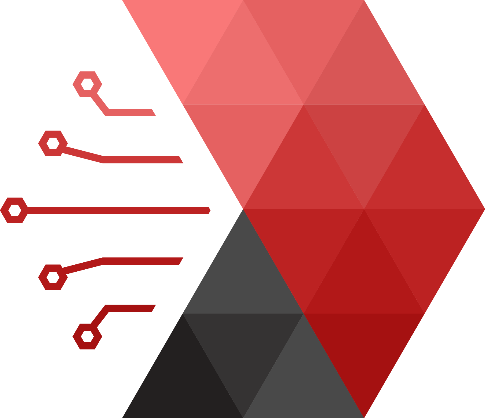

<!-- <h1 align="left">Hi there , I'm Minghao Du</h1>   -->
<h1 align="left">Hi there , I'm Minghao Du</h1>  

## A business student who loves tech

- 🖥 𝙵𝚞𝚕𝚕-𝚜𝚝𝚊𝚌𝚔 𝚜𝚘𝚏𝚝𝚠𝚊𝚛𝚎 𝚍𝚎𝚟𝚎𝚕𝚘𝚙𝚎𝚛 | Data Analyst 

<!-- - 💼 Co-𝙵𝚘𝚞𝚗𝚍𝚎𝚛 𝚊𝚝 [Shuyuan Group](www.shuyuaninc.com) -->
- 💼 Co-𝙵𝚘𝚞𝚗𝚍𝚎𝚛 𝚊𝚝  [Shuyuan Inc.](www.shuyuaninc.com)

- 💼 Data Analysis Consulting Associate at  [PwC](www.pwc.com)

- 🎓 BS in Management, Marketting, and Management Information Systems (the University of Alabama)

- 🎓 MS in Infomation Systems (the Johns Hopkins 𝚄𝚗𝚒𝚟𝚎𝚛𝚜𝚒𝚝𝚢)

- 🎓 MS in Applied Analytics (Columbia 𝚄𝚗𝚒𝚟𝚎𝚛𝚜𝚒𝚝𝚢) 

- 👨‍💻 All of my projects are available at 

- 📄 Know about my experiences 

 

## :zap: Recent GitHub Activity

<!--START_SECTION:activity-->
1. ❗️ Closed issue [#2](https://github.com/DMinghao/DMinghao/issues/2) in [DMinghao/DMinghao](https://github.com/DMinghao/DMinghao)
2. ❗️ Opened issue [#2](https://github.com/DMinghao/DMinghao/issues/2) in [DMinghao/DMinghao](https://github.com/DMinghao/DMinghao)
<!--END_SECTION:activity-->

 
<!--
## 🔧 Languages and Tools:

 
     
     
     
     
     
     
     
     
     
     
     
     
     
     
     
     
     
     
     
     
     
     
     
     
     
     
     
     
     
     
     
     
     
     
     

-->
 

## &#x1f4c8; GitHub Stats
<!-- 
 -->
<a href="https://github.com/DMinghao/DMinghao">
  
  <!--  -->
</a>

<!-- 
 -->

